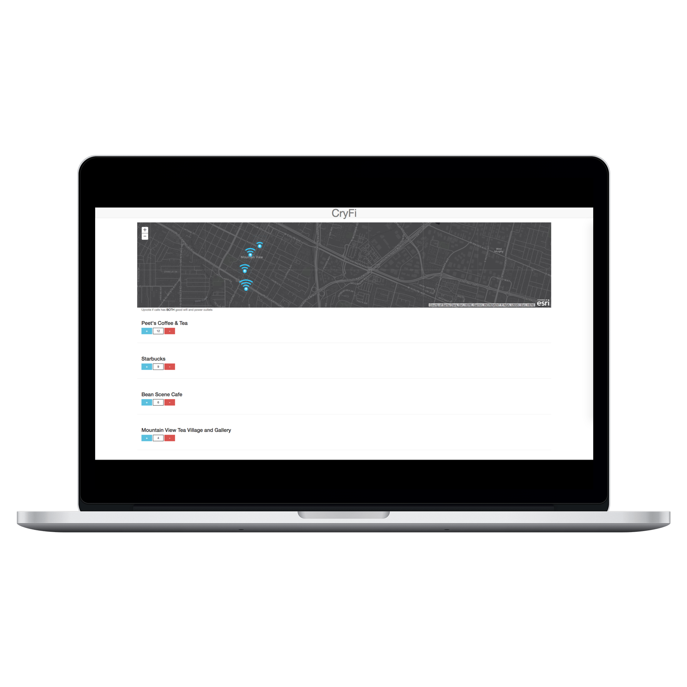

# Cryfi
At the angelHack hackathon hosted by HP in Sunnyvale, we were all crying for some wifi. It was a common pain point we all shared. So we decided to hack together a web app that would give us locations of nearby Cafes with both wifi and power plugs.

# Live Demo 

[GitHub Pages Host](https://yatso.github.io/cryfi/)

